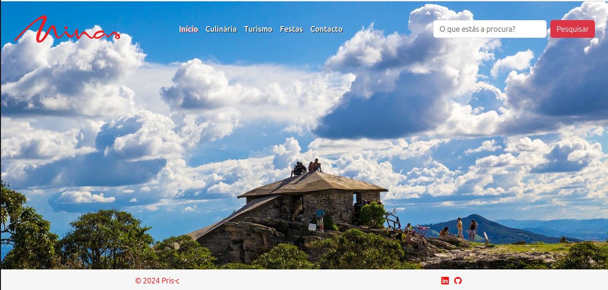
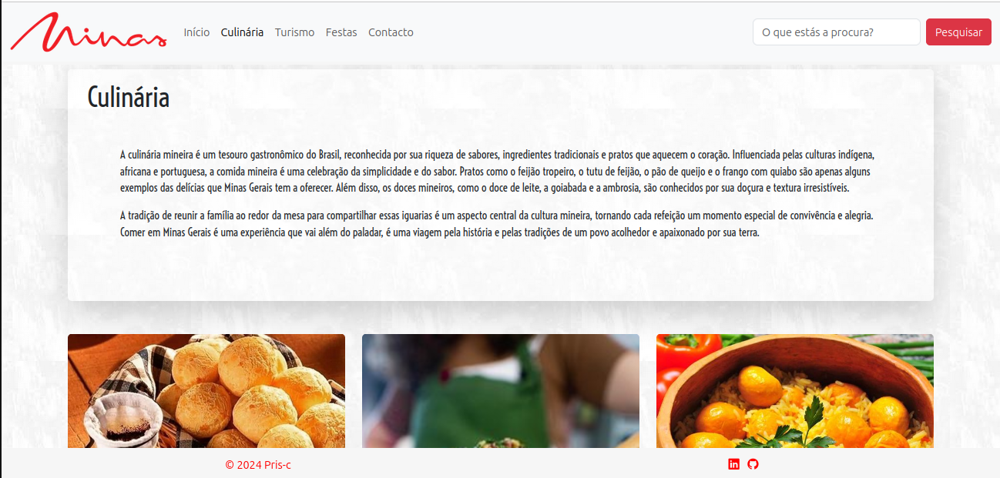
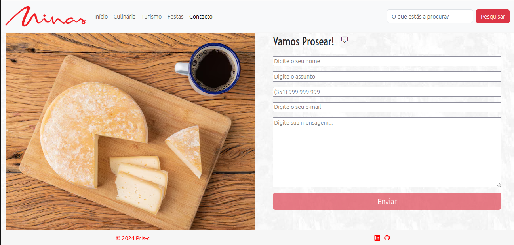

# Uai Pois 

O **Uai Pois** é um site criado para celebrar e compartilhar a rica cultura de Minas Gerais. Através dele, você poderá explorar aspectos incríveis da culinária local, apreciar a beleza dos destinos turísticos, conhecer as tradicionais festas e se entregar à riqueza cultural do estado. Navegue pelas nossas seções e descubra tudo o que Minas tem a oferecer. [Visite aqui !](https://pris-c.github.io/uai-pois/index.html)

|  |  |  |
| :----------------------------------------------------: | :------------------------------------------------------: | :-----------------------------------------------------: |
|                     Página Inicial                     |                     Página Culinária                     |                     Página Contacto                     |

## Estrutura do Projeto

O projeto está organizado da seguinte forma:

```plaintext
uai-pois/
├── imagens/
│ ├── comum/
│ │ ├── favicon.png
│ │ ├── minas-logo.png
│ │ └── textura.jpeg
│ ├── contacto/
│ │ ├── prosa_cafe_paodequeijo.avif
│ │ └── bandeira-favicon.png
│ └── culinaria/
│ │ ├── arrozpequi.jpg
│ │ ├──  cachaça.jpg
│ │ ├── carnedesol.jpg
│ │ ├── docedeleite.jpg
│ │ ├── feijaotropeiro.jpg
│ │ ├── frangocaipira.jpg
│ │ ├── frangocomquiabo.jpg
│ │ ├── goiabada.jpg
│ │ ├── paodequeijocafe.jpg
│ │ ├── queijo.jpg
│ │ ├── torresmo.jpg
│ │ ├── tutudefeijao.jpg
│ │ └── vacaatolada.jpg
│ ├── paginainicial/
│ │ └── wpp-saothome.jpg
├── script/
│ └── meujs.js
├── style/
│ ├── comum.css
│ ├── contacto.css
│ ├── culinaria.css
│ └── paginainicial.css
├── contacto.html
├── culinaria.html
├── festas.html
├── index.html
└── turismo.html
```

## Descrição das Páginas

### Página Inicial (`index.html`)

- **Descrição**: Página inicial do site.
- **Recursos**:
  - Navbar com links para outras seções.
  - Rodapé com links para redes sociais.

### Culinária (`culinaria.html`)

- **Descrição**: Apresenta a rica gastronomia mineira com textos descritivos e uma galeria de imagens.
- **Recursos**:
  - Galeria de imagens de pratos típicos.
  - Texto descritivo sobre a influência e importância da culinária mineira.

### Turismo (`turismo.html`)

- **Descrição**: Informações sobre os pontos turísticos de Minas Gerais.
- **Recursos**:
  - Página não implementada

### Festas (`festas.html`)

- **Descrição**: Aborda as festas tradicionais de Minas Gerais.
- **Recursos**:
  - Página não implementada

### Contacto (`contacto.html`)

- **Descrição**: Página de contato para os usuários entrarem em comunicação.
- **Recursos**:
  - Formulário de contato com campos para nome, assunto, telefone, e-mail e mensagem.
  - Toast de confirmação de envio de mensagem.

## Tecnologias Utilizadas

- **HTML**: Estruturação das páginas.
- **CSS**: Estilos das páginas, com uso de [Bootstrap](https://getbootstrap.com/) para facilitar a responsividade e estilização, [Bootstrap Icons](https://icons.getbootstrap.com/) para ícones e [Google Fonts](https://fonts.google.com/) para fontes personalizadas.
- **JavaScript**: Scripts para interatividade das páginas.

## Como Executar o Projeto

1. Clone o repositório:

   ```sh
   git clone https://github.com/Pris-c/uai-pois.git
   ```

2. Navegue até o diretório do projeto

   ```sh
   cd uai-pois
   ```

3. Abra o arquivo `index.html` em um navegador web para visualizar o site.

## Contribuição

Contribuições são bem-vindas! Sinta-se à vontade para abrir issues ou enviar pull requests com melhorias e correções.

## Autor

Priscila Campos 👩‍💻
